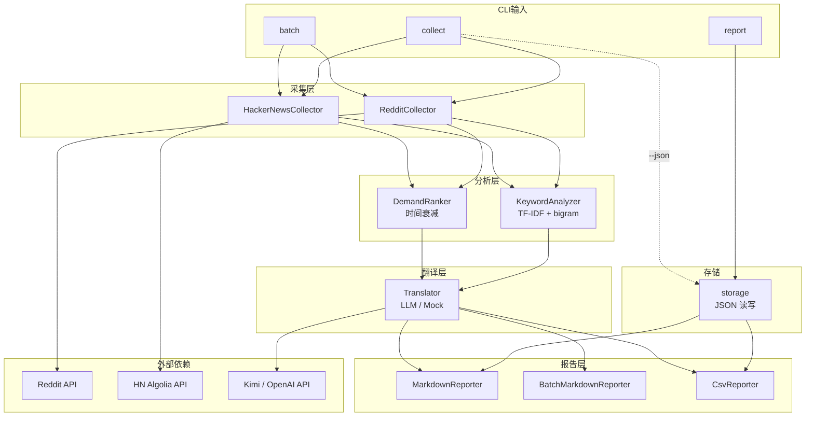

# Community Demand Collector 功能图

> 本文档描述项目各模块的输入/输出与数据流，便于功能完善与扩展。

---

## 一、整体架构（Mermaid 流程图）



---

## 二、collect 子命令 — 单关键词采集

```mermaid
flowchart LR
    subgraph 输入
        IN1["-k, --keyword"]
        IN2["-s, --source<br/>reddit | hackernews"]
        IN3["-l, --limit"]
        IN4["-r, --subreddits<br/>(reddit)"]
        IN5["-t, --translate"]
        IN6["-m, --mock"]
        IN7["-o, --output"]
        IN8["-f, --format<br/>md | csv"]
        IN9["-j, --json<br/>导出 JSON"]
    end

    subgraph 1_采集
        C1[RedditCollector<br/>HackerNewsCollector]
    end

    subgraph 2_分析
        A1[KeywordAnalyzer]
        A2[DemandRanker]
    end

    subgraph 3_翻译
        T[Translator]
    end

    subgraph 4_报告
        R[MarkdownReporter<br/>CsvReporter]
    end

    subgraph 输出
        OUT[report.md / report.csv]
        OUT2[data.json]
    end

    IN1 & IN2 & IN3 & IN4 --> C1
    C1 --> |Post[]| A1
    C1 --> |Post[]| A2
    A1 --> |Map| R
    A2 --> |topDemands| T
    T --> |titleZh, summaryZh| R
    R --> OUT
    IN9 -.->|可选| OUT2
```

### 各模块输入/输出

| 模块 | 输入 | 输出 |
|------|------|------|
| **RedditCollector** | `CollectorConfig` | `Post[]` |
| **HackerNewsCollector** | `CollectorConfig` | `Post[]`（HN Algolia API） |
| **KeywordAnalyzer** | `Post[]`, topN=30, minDf=2 | `Map<string, number>`：TF-IDF 加权，含 unigram + bigram |
| **DemandRanker** | `Post[]`, limit | `Post[]`：按热度排序，含时间衰减（decay=0.98） |
| **Translator** | `Post[]`（高热度帖子） | `Post[]`：增加 titleZh, summaryZh（含商业价值、优先级） |
| **MarkdownReporter** | `ReportData` | `.md` 文件 |
| **CsvReporter** | `ReportData` | `.csv` 文件：rank, title, titleZh, author, score, comments, engagement, date, url, summaryZh |
| **storage** | `ReportData` / JSON 路径 | 保存或加载 JSON |

---

## 三、batch 子命令 — 多关键词批量采集

支持 `-s reddit | hackernews`，对每个关键词执行采集 → 分析 → 翻译 → 汇总为 `batch-report.md`。

---

## 四、report 子命令 — 从 JSON 生成报告

从 `collect -j` 保存的 JSON 重新生成报告，实现采集与报告解耦。

| 选项 | 说明 |
|------|------|
| `-i, --input <path>` | 必填，JSON 文件路径 |
| `-o, --output <path>` | 输出路径，默认 `./reports/report.md` |
| `-f, --format <format>` | `md` \| `csv`，默认 `md` |

示例：`report -i ./data/collect.json -o ./reports/report.md -f csv`

---

## 五、Post 数据结构（核心流转对象）

```
Post {
  id: string
  title: string
  content: string
  author: string
  url: string
  score: number
  commentCount: number
  createdAt: Date
  platform: Platform
  raw?: Record<string, unknown>     // 可选，平台原始数据
  titleZh?: string                  // 翻译后才有
  summaryZh?: string                // 翻译后才有
}
```

---

## 六、环境变量与外部 API

| 用途 | 环境变量 | 说明 |
|------|----------|------|
| LLM 翻译 | `OPENAI_API_KEY` | Kimi / OpenAI API Key |
| LLM 翻译 | `OPENAI_BASE_URL` | 如 `https://api.moonshot.cn/v1` |
| LLM 翻译 | `OPENAI_MODEL` | 如 `kimi-k2.5`，默认 kimi-k2.5 |
| Reddit | 无鉴权 | 公开 JSON API |
| Hacker News | 无鉴权 | HN Algolia API |

---

## 七、当前能力

1. **采集**：Reddit、Hacker News
2. **分析**：TF-IDF + bigram 关键词，时间衰减热度排序
3. **翻译**：Kimi、OpenAI 兼容接口；Mock 模式；商业价值、优先级洞察
4. **报告**：Markdown、CSV；`report` 子命令从 JSON 生成
5. **数据复用**：`collect -j` 导出 JSON，`report -i` 读取
